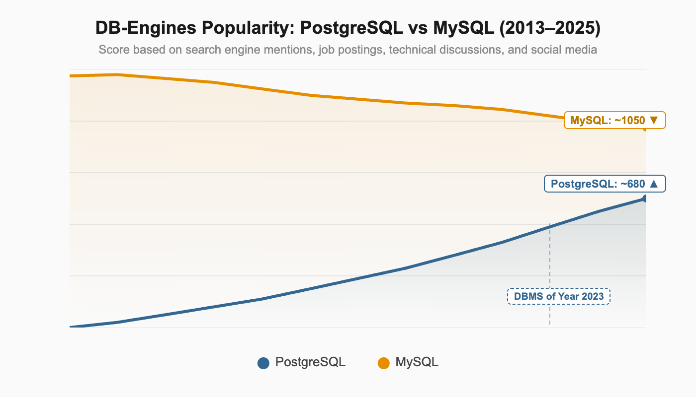
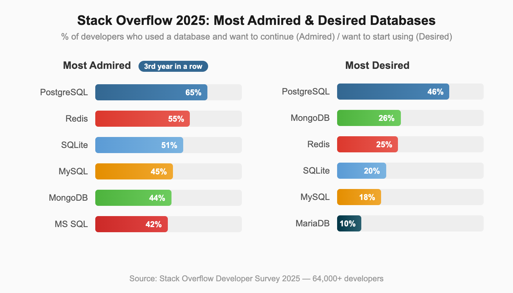
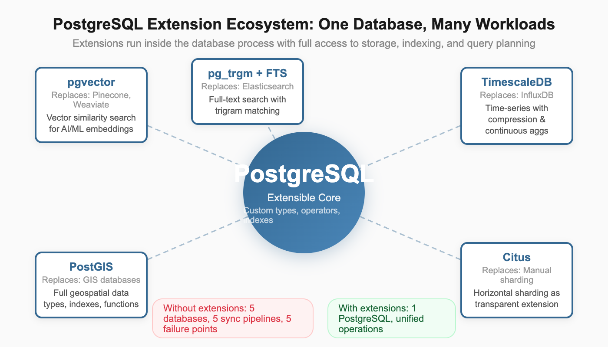
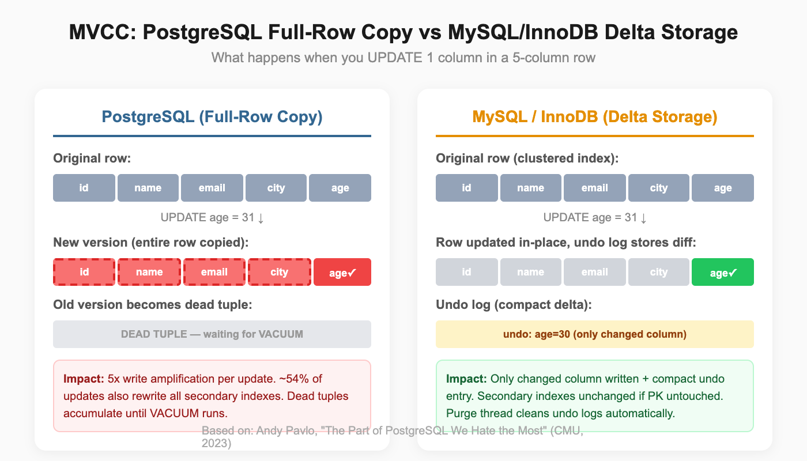
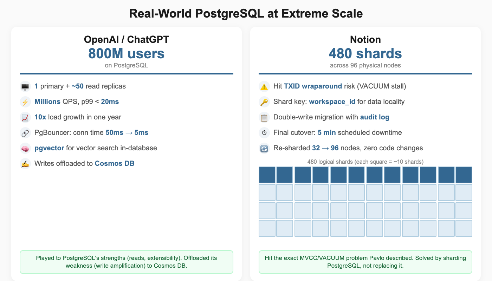
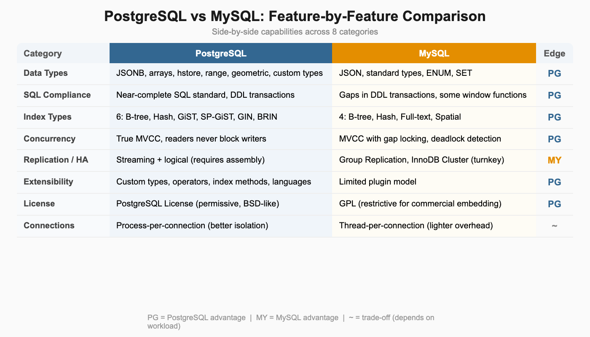
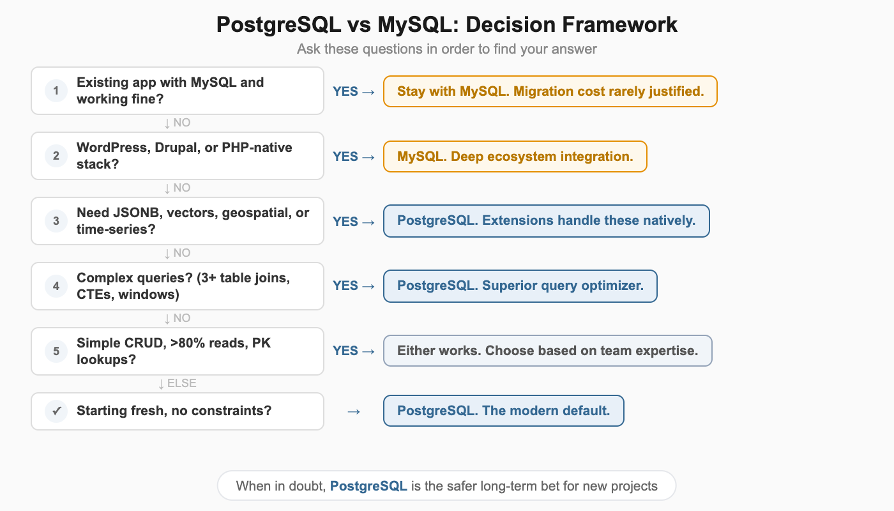
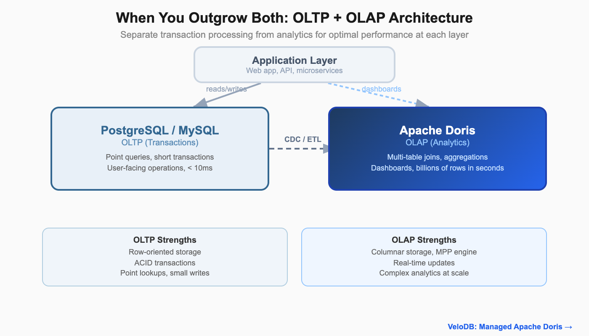

# PostgreSQL vs MySQL: Why PostgreSQL Is Winning and When It Matters



PostgreSQL vs MySQL is no longer a close contest in developer mindshare. The data tells a clear story: PostgreSQL has been climbing the [DB-Engines rankings](https://db-engines.com/en/ranking_trend) for over a decade, earning [DBMS of the Year](https://db-engines.com/en/blog_post/106) five times (2017, 2018, 2019, 2023, 2024), more than any other database. The [Stack Overflow 2025 Developer Survey](https://survey.stackoverflow.co/2025/) confirms the trend: PostgreSQL is the most admired database (65%) and most desired database (46%) for the third consecutive year, while MySQL's mindshare has steadily declined.



These are not abstract survey numbers. OpenAI runs ChatGPT's backend for 800 million users on PostgreSQL. Notion sharded PostgreSQL to 480 shards serving millions of users. The world's most demanding applications are choosing PostgreSQL, and they are choosing it for specific architectural reasons.

But MySQL still powers a massive portion of the web. WordPress alone accounts for over 40% of all websites, and every WordPress installation runs on MySQL. Shopify and Facebook built their empires on MySQL too. Understanding WHY PostgreSQL is winning (and where MySQL still makes sense) requires looking at architecture, not feature checklists.

This article explains the architectural foundations behind each database, compares real-world capabilities with specific evidence, and gives you an actionable framework for choosing between them.

## Architectural Foundations: Why They Differ

The architectural differences between PostgreSQL and MySQL explain every practical comparison that follows. These are not random design choices. They reflect fundamentally different philosophies about what a database should be.

### PostgreSQL's Unified Extensible Architecture

PostgreSQL uses a process-per-connection model where each client connection gets its own dedicated operating system process. This provides strong isolation: a crash in one connection does not bring down others.

More importantly, PostgreSQL was designed from the ground up to be extensible. The core architecture supports custom data types, custom operators, custom index methods, and custom procedural languages. This is not a plugin system bolted on as an afterthought. It is the fundamental design principle.

This extensibility is why PostgreSQL keeps winning new use cases. When AI applications needed vector search, the community built [pgvector](https://github.com/pgvector/pgvector) as a PostgreSQL extension. When geospatial applications needed a database, [PostGIS](https://postgis.net/) turned PostgreSQL into a full GIS platform. These extensions run inside the database process with access to PostgreSQL's storage engine, indexing infrastructure, and query planner. They are not separate services that require network calls and data synchronization.

PostgreSQL prioritized SQL compliance and correctness from the start. It supports DDL transactions (you can ROLLBACK a CREATE TABLE), advanced data types, and sophisticated query planning.

### MySQL's Pluggable Storage Engine Design

MySQL took a different path. Its pluggable storage engine architecture lets you swap the underlying storage layer. The InnoDB engine (now the default) provides ACID transactions and row-level locking, while the older MyISAM engine offered faster reads at the cost of no transaction support. This history matters because many MySQL behaviors and workarounds trace back to the MyISAM era.

The pluggable engine design has a consequence worth understanding: each storage engine can have different transaction semantics, locking behavior, and consistency guarantees. A table using InnoDB behaves differently from a table using MyISAM in the same database. PostgreSQL's single storage engine means consistent behavior across all tables, always.

MySQL uses a thread-per-connection model. Threads are lighter than processes, which gives MySQL lower per-connection overhead. For simple web applications handling thousands of short-lived connections, this design works well. MySQL 8.0 also introduced a thread pool plugin for enterprise deployments, which reuses threads across connections for even lower overhead under high concurrency.

MySQL's design prioritized read speed, simplicity, and web-scale deployment. It was built for the LAMP stack era, where applications needed fast reads, simple queries, and easy setup. That focus made MySQL the world's most popular open-source database for over a decade. Facebook, YouTube, Twitter (in its early days), and millions of WordPress sites all relied on MySQL's straightforward model.

### The Cascade Effect

These architectural choices cascade into every practical difference. PostgreSQL's extensibility explains why it dominates in complex use cases. MySQL's simplicity explains why it remains the default for WordPress and traditional web applications. The next sections trace these consequences through real-world features, performance, and production deployments.

## PostgreSQL's Extensible Architecture: The Superpower

No feature comparison captures what truly separates PostgreSQL from MySQL. The difference is architectural: PostgreSQL was designed to let the community extend the database itself, not just build tools around it.

### The Extension Model

PostgreSQL extensions run inside the database process. They have direct access to PostgreSQL's storage layer, indexing infrastructure, and query planning system. This is a crucial distinction from external tools that communicate over a network. Extensions can:

- Define entirely new data types with full operator support (comparison, arithmetic, containment)
- Create custom index methods optimized for specific data patterns
- Add new procedural languages for writing server-side functions
- Implement custom storage managers for specialized workloads

When you install pgvector, your vector similarity searches use PostgreSQL's query planner, benefit from PostgreSQL's MVCC concurrency, and respect PostgreSQL's transaction boundaries. There is no separate service to deploy, monitor, or synchronize data with.

### Extensions That Replace Entire Databases

The practical impact of this architecture is striking. Each of these extensions replaces what would otherwise require a separate specialized database:

| Extension | Replaces | Capability |
|-----------|----------|------------|
| pgvector | Pinecone, Weaviate | Vector similarity search for AI/ML embeddings |
| PostGIS | Specialized GIS databases | Full geospatial data types, indexes, and functions |
| TimescaleDB | InfluxDB, specialized time-series DBs | Time-series with continuous aggregates and compression |
| Citus | Manual sharding / distributed DBs | Horizontal sharding as a transparent extension |
| pg_trgm + Full-Text Search | Elasticsearch (for many use cases) | Full-text search with trigram matching |

Instead of running five different databases (relational + vector + geospatial + time-series + search), PostgreSQL with extensions can handle many of these workloads in one system. That means less operational overhead, fewer moving parts, and no data synchronization pipelines between systems.



### The Composability Advantage

Extensions work together. TimescaleDB + PostGIS enables spatio-temporal analytics (tracking asset movements over time). pgvector + full-text search enables hybrid search (combining semantic similarity with keyword matching). Citus + any other extension lets you shard workloads that use custom data types.

This composability is unique to PostgreSQL. MySQL's plugin model does not provide equivalent access to the storage engine and query planner, so MySQL extensions cannot achieve the same depth of integration.

For teams building modern applications that span multiple data paradigms (relational + vector + geospatial, or relational + time-series + search), PostgreSQL's extension architecture lets you consolidate what would otherwise be a complex multi-database deployment into a single system you already know how to operate.

## The Part of PostgreSQL We Hate the Most

PostgreSQL is winning, but it has a genuine architectural weakness that anyone evaluating the database should understand. In April 2023, Andy Pavlo (CMU professor and one of the most respected database researchers) published a widely-discussed critique of PostgreSQL's MVCC implementation titled ["The Part of PostgreSQL We Hate the Most."](https://www.cs.cmu.edu/~pavlo/blog/2023/04/the-part-of-postgresql-we-hate-the-most.html) Acknowledging this weakness honestly is important because it affects real-world scaling decisions.

### The Core Problem: 1980s MVCC Design



PostgreSQL duplicates entire rows on any update. Change one column in a row with 50 columns, and all 49 untouched columns get copied to a new version. Oracle and MySQL's InnoDB use delta storage, recording only the changed values. For wide tables with frequent updates, PostgreSQL generates significantly more I/O.

Dead tuples accumulate as updates create new row versions. A 50GB table can hold only 10GB of live data and 40GB of dead tuples. Standard VACUUM removes dead tuples but does not reclaim disk space to the operating system. VACUUM FULL reclaims space but requires an expensive table rewrite that locks the table.

Every non-HOT (Heap-Only Tuple) update modifies all secondary indexes because the new row version has a different physical location. Pavlo's analysis shows approximately 54% of updates incur this penalty.

This is exactly what hit Uber. In 2016, Uber's engineering team [published their migration from PostgreSQL to MySQL](https://www.uber.com/blog/postgres-to-mysql-migration/), one of the most widely discussed database migrations in the industry. Their tables had a dozen or more indexes. Updating a single field in PostgreSQL propagated writes to all of them. That write amplification cascaded into replication: cross-datacenter WAL streams between coasts consumed so much bandwidth that replicas couldn't keep up during peak traffic. A PostgreSQL 9.2 bug during a master promotion made things worse, causing data corruption that spread through the entire replica hierarchy via physical replication. Uber built Schemaless, a sharding layer on top of MySQL's InnoDB, where delta-based updates and primary-key-based replication avoided these problems.

Autovacuum adds operational complexity. Default thresholds are often suboptimal for large tables. Long-running transactions block vacuum progress, which can cascade into transaction ID wraparound risk, where PostgreSQL will actually stop accepting writes to prevent data corruption.

### Why PostgreSQL Wins Anyway

Despite this genuine weakness, PostgreSQL's extensible architecture, SQL compliance, and ecosystem outweigh the MVCC cost for most workloads. The MVCC penalty primarily affects write-heavy OLTP with frequent updates to wide tables. For read-heavy, complex-query, or mixed workloads (which describes most applications), PostgreSQL's advantages dominate.

There is also active work to address the problem. The PostgreSQL community has improved HOT updates, added heap pruning, and continues to optimize autovacuum behavior with each release. Third-party tools like pg_repack provide online table reorganization without the full-table locks that VACUUM FULL requires. The weakness is real, but the ecosystem provides practical mitigations.

The next section shows how companies at extreme scale deal with this trade-off in production.

## Real-World Proof: OpenAI and Notion



Feature comparisons and benchmarks are useful, but nothing beats seeing how databases perform under real production pressure. Both OpenAI and Notion hit PostgreSQL's known limitations and scaled through them rather than abandoning the database.

### OpenAI: 800 Million ChatGPT Users on PostgreSQL

OpenAI shared their PostgreSQL scaling story in their engineering blog post ["Scaling PostgreSQL to power 800 million ChatGPT users."](https://openai.com/index/scaling-postgresql/) The numbers are staggering:

- **Architecture**: Single primary Azure PostgreSQL Flexible Server instance with approximately 50 read replicas across multiple regions
- **Scale**: Millions of queries per second with p99 latency in low double-digit milliseconds
- **Growth**: 10x load increase over one year
- **Connection pooling**: PgBouncer reduced connection establishment time from 50ms to 5ms, enabling efficient connection reuse across application servers

OpenAI explicitly acknowledged the MVCC write amplification challenge. Their solution: offload write-heavy workloads to Azure Cosmos DB while keeping PostgreSQL for relational consistency and read-heavy operations. This is a pragmatic architectural decision. Rather than fighting PostgreSQL's weakness, they played to its strengths.

The team also uses pgvector for vector similarity search within the same PostgreSQL infrastructure. This is the extensibility advantage in action: instead of deploying a separate vector database, OpenAI runs vector search alongside their relational data in the same system.

### Notion: 480 Shards, Confronting VACUUM Head-On

Notion's engineering team documented their scaling journey across two blog posts: ["Herding elephants: lessons learned from sharding Postgres at Notion"](https://www.notion.com/blog/sharding-postgres-at-notion) and ["The Great Re-shard."](https://www.notion.com/blog/the-great-re-shard)

Notion started as a PostgreSQL monolith and hit exactly the VACUUM stall problem that Pavlo described. Transaction ID wraparound risk forced action: left unchecked, PostgreSQL would stop all writes to prevent data corruption.

Their solution was aggressive sharding:

- **480 logical shards** distributed across 32 (later 96) physical PostgreSQL databases
- **Workspace ID as sharding key** for data locality, keeping each workspace's data together
- **Double-write migration** with an audit log to verify data consistency
- **5 minutes of scheduled downtime** for the final cutover

The elegant part: when they later needed more capacity, they re-sharded from 32 to 96 physical nodes by redistributing the 480 logical shards. No application code changes required.

### What These Prove

Both companies hit PostgreSQL's MVCC weakness at scale. Both chose to scale PostgreSQL rather than replace it. The extensible ecosystem (PgBouncer for connection pooling, logical replication for data distribution, application-level sharding strategies) provided the tools to work around the limitation.

The conclusion is practical: PostgreSQL's strengths in extensibility, SQL compliance, and query sophistication outweigh its MVCC costs for most applications, even at extreme scale. When you do hit the MVCC wall, you can architect around it without abandoning the database.

## Feature Comparison: Where Each Database Wins



With the architectural context established, here is how PostgreSQL and MySQL compare across specific capabilities.

| Category | PostgreSQL | MySQL |
|----------|-----------|-------|
| **Data Types** | JSONB, arrays, hstore, range, geometric, custom types | JSON, standard types, ENUM, SET |
| **SQL Compliance** | Near-complete SQL standard | Gaps in DDL transactions, some window function types |
| **Indexing** | 6 types: B-tree, Hash, GiST, SP-GiST, GIN, BRIN | 4 types: B-tree, Hash, Full-text, Spatial |
| **MVCC** | True MVCC, readers never block writers | MVCC with gap locking, deadlock detection |
| **Replication** | Streaming + logical replication | Group Replication, InnoDB Cluster (more mature HA) |
| **Extensibility** | Custom types, operators, index methods, languages | Limited plugin model |
| **License** | PostgreSQL License (permissive, BSD-like) | GPL (restrictive for commercial embedding) |
| **Connection Model** | Process-per-connection (better isolation) | Thread-per-connection (lighter overhead) |

### Data Types and JSON

PostgreSQL's JSONB stores JSON in a decomposed binary format with GIN indexing. You can query deeply nested JSON paths, create indexes on specific JSON keys, and perform containment checks (@>) without parsing the entire document. MySQL 8.0 added JSON support, but queries require parsing JSON on each access, making them significantly slower for analytical workloads on semi-structured data.

If your application stores semi-structured data alongside relational tables (user preferences, event metadata, configuration objects), PostgreSQL's JSONB with indexing can be the deciding factor.

### SQL Compliance

PostgreSQL supports DDL transactions, meaning you can wrap schema changes in a transaction and ROLLBACK if something goes wrong. This is invaluable for migration scripts. MySQL commits DDL statements implicitly, so a failed migration midway leaves your schema in a partially applied state.

PostgreSQL also handles recursive CTEs, LATERAL joins, and advanced window functions more completely. MySQL 8.0 closed many gaps by adding CTEs and window functions, but edge cases in standard compliance remain.

### Concurrency

PostgreSQL's MVCC means readers never block writers and writers never block readers. Every transaction sees a consistent snapshot of the database. MySQL's InnoDB uses gap locking for range queries under the REPEATABLE READ isolation level (the default). Under high concurrent write loads to adjacent key ranges, this gap locking can cause deadlocks that require application-level retry logic.

For workloads with 100+ concurrent connections mixing reads and writes, PostgreSQL's concurrency model produces more predictable behavior.

### Replication and High Availability

MySQL has a genuine edge here. Group Replication and InnoDB Cluster provide a more complete high-availability solution out of the box, with automatic failover and conflict resolution built into the database itself. MySQL Router handles connection routing to the active primary.

PostgreSQL requires more assembly for HA. Streaming replication provides the foundation, but automated failover requires external tools like Patroni or pg_auto_failover. This gap is narrowing as the PostgreSQL ecosystem matures, but MySQL's HA story is still more turnkey.

### License

PostgreSQL uses a permissive BSD-like license. You can embed it in commercial products, modify it, and distribute it without source code obligations. MySQL uses GPL, which requires any software that links to MySQL to also be open-sourced (or you must purchase a commercial license from Oracle). For companies building commercial products that embed a database, this license difference is significant.

## Performance: Specific Scenarios

Vague performance claims ("PostgreSQL is faster") are useless. Performance depends on workload patterns, and each database has scenarios where it wins.

**Simple reads (primary key lookups)**: MySQL is slightly faster, approximately 5-15% for high-throughput simple queries. MySQL's thread-per-connection model has lower per-query overhead for short-lived operations, and InnoDB's clustered index provides fast primary key access.

**Complex queries (joins, subqueries, CTEs)**: PostgreSQL's query optimizer is more sophisticated. For queries joining 4+ tables with mixed conditions, PostgreSQL can be 2-5x faster because its optimizer evaluates more join strategies and produces better execution plans.

**Write concurrency**: PostgreSQL handles concurrent writes more gracefully for most patterns. Under 100+ concurrent write connections, PostgreSQL's true MVCC avoids the gap locking issues that can slow MySQL. However, for very write-heavy workloads on wide tables, MySQL's delta-based MVCC (InnoDB undo logs) produces less write amplification than PostgreSQL's full-row copying.

**JSON operations**: PostgreSQL's JSONB with GIN indexing is orders of magnitude faster than MySQL's JSON for path queries on large documents. If you're running JSON path queries across millions of rows, this is not a marginal difference.

**Full-text search**: PostgreSQL's built-in full-text search with tsvector/tsquery and the pg_trgm extension handles most search use cases without an external search engine. MySQL has built-in full-text indexing for InnoDB, but it is limited to basic match patterns and does not support ranking, phrase proximity, or the flexible query language that PostgreSQL offers. For applications that need search beyond basic keyword matching but don't want to deploy Elasticsearch, PostgreSQL has the advantage.

**Connection overhead at scale**: MySQL handles very large numbers of lightweight connections more efficiently due to its threading model. If your application opens 10,000+ connections with short-lived queries (common in microservices architectures without connection pooling), MySQL's lower per-connection memory footprint matters. PostgreSQL addresses this with connection poolers like PgBouncer, but that adds another component to manage.

**The honest summary**: [Bytebase's analysis](https://www.bytebase.com/blog/postgres-vs-mysql/) shows "at most 30% variations" for comparable standard workloads. The real performance difference in production comes from query design and indexing strategy (10x-1000x impact), not the database engine choice. Pick the database that matches your workload pattern, then optimize your queries.

## Decision Framework



Here are specific criteria with actionable thresholds to guide your choice.

### Choose PostgreSQL When

- **Data model needs JSONB, arrays, custom types, or geospatial data.** If your schema includes semi-structured data, PostgreSQL's type system saves you from workarounds.
- **Workload includes complex queries.** Joins across 3+ tables, recursive CTEs, window functions: PostgreSQL's optimizer handles these better.
- **Building AI features that need vector search.** pgvector eliminates the need for a separate vector database. If you're already on PostgreSQL, adding vector search is one extension install.
- **Running multiple workload types in one database.** Relational + search + time-series + geospatial: PostgreSQL extensions consolidate what would otherwise be a multi-database deployment.
- **License matters for your product.** If you're embedding the database in commercial software, PostgreSQL's permissive license avoids GPL obligations.
- **Starting a new project with no legacy constraints.** PostgreSQL is the modern default. Developer mindshare, ecosystem momentum, and extension availability all favor it.

### Choose MySQL When

- **Existing application with MySQL expertise.** Migration cost rarely justifies the switch for a working application. If your team knows MySQL and the application runs well, stay with MySQL.
- **Read-heavy web application with simple query patterns.** If 80%+ of queries are primary key lookups or simple WHERE clauses, MySQL's lighter connection overhead is an advantage.
- **WordPress, Drupal, or PHP-based stack.** MySQL integration is deeply embedded in these ecosystems. Using PostgreSQL with WordPress creates unnecessary friction.
- **Need turnkey HA with minimal assembly.** InnoDB Cluster and MySQL Router provide automated failover with less operational setup than PostgreSQL equivalents.
- **Team is small and operational simplicity matters.** MySQL has fewer tuning knobs and a simpler operational model. For small teams without dedicated database expertise, this matters.

### Decision Table by Use Case

| Use Case | Recommended | Why |
|----------|-------------|-----|
| New SaaS product | PostgreSQL | Extensions, JSONB, growing ecosystem |
| AI/ML application | PostgreSQL | pgvector eliminates separate vector DB |
| Geospatial application | PostgreSQL | PostGIS has no MySQL equivalent |
| WordPress/CMS site | MySQL | Native integration, mature ecosystem |
| Legacy PHP application | MySQL | Migration cost rarely justified |
| High-write financial system | PostgreSQL | True MVCC, DDL transactions for safe migrations |
| Simple CRUD API | Either | Both handle this well; choose based on team expertise |
| Time-series analytics | PostgreSQL | TimescaleDB extension |
| Multi-model data (relational + JSON + vector) | PostgreSQL | Extension architecture handles all three natively |

## When You Outgrow Both: The Analytics Bridge



Both PostgreSQL and MySQL are OLTP databases. They handle transactions, serve application queries, and maintain data consistency. They were not designed for heavy analytical workloads.

You will notice the boundary when dashboards slow down, when aggregating 100M+ rows blocks your connection pool, when cross-table analytical queries start competing with transaction processing for resources. Symptoms include: reporting queries that used to take 2 seconds now taking 30 seconds, read replica lag increasing during dashboard refresh cycles, and application response times spiking during end-of-day analytics runs.

Adding read replicas helps temporarily, but the fundamental issue remains: OLTP databases optimize for point queries and short transactions, not for scanning billions of rows across multiple tables. A PostgreSQL read replica running the same row-oriented storage engine does not magically become a columnar analytics engine.

The common scaling pattern separates OLTP from OLAP:

```
[Application] → [PostgreSQL / MySQL] → [Data Replication] → [Analytical Database]
                  (transactions)                              (dashboards, reports)
```

### The Analytical Database Landscape

Several systems compete to fill the analytical layer. Each makes different trade-offs:

**Cloud-managed warehouses** like [Amazon Redshift](https://aws.amazon.com/redshift/) and [Google BigQuery](https://cloud.google.com/bigquery) provide fully managed analytical databases with tight ecosystem integration. Redshift uses a columnar MPP architecture and integrates deeply with AWS services. BigQuery offers serverless execution with automatic scaling and pay-per-query pricing. Both excel at batch analytics on large datasets. The trade-off: vendor lock-in, less control over performance tuning, and query latency that can be too high for user-facing dashboards (BigQuery's cold start can take seconds).

**[ClickHouse](https://clickhouse.com/)** is an open-source columnar database optimized for append-heavy analytical workloads. It delivers exceptional performance on single-table aggregations and time-series data. Ingestion speed is a strength. The trade-off: multi-table joins are weaker than MPP systems designed for them, and real-time updates (UPDATE/DELETE) are expensive operations, not first-class features.

**[Tinybird](https://www.tinybird.co/)** provides a real-time analytics API layer built on top of ClickHouse. You define data sources and API endpoints, and Tinybird handles the infrastructure. It is ideal for teams that want to expose analytics as REST APIs without managing a database cluster. The trade-off: abstraction limits complex ad-hoc queries and multi-table joins.

**[Apache Doris](https://doris.apache.org/)** is an open-source MPP analytical database that combines real-time ingestion with strong multi-table join performance. It supports real-time UPDATE and DELETE operations natively, speaks MySQL-compatible SQL, and handles both batch and streaming workloads. [VeloDB](https://www.velodb.io/) offers Apache Doris as a fully managed cloud service. The trade-off: smaller community than ClickHouse, fewer cloud-native integrations than Redshift or BigQuery.

### Choosing Your Analytical Layer

| Scenario | Good Fit | Why |
|----------|----------|-----|
| Batch BI on AWS ecosystem | Redshift | Deep AWS integration, mature tooling |
| Serverless analytics, pay-per-query | BigQuery | No infrastructure management, scales to zero |
| High-volume append-only metrics/logs | ClickHouse | Fastest single-table aggregation throughput |
| Analytics exposed as REST APIs | Tinybird | API-first abstraction over ClickHouse |
| Real-time dashboards with multi-table joins and updates | Apache Doris / VeloDB | MPP joins + real-time upserts + MySQL protocol + high concurrency |

The integration pattern is the same regardless of which analytical database you choose. Use CDC (Change Data Capture) or batch replication to stream data from PostgreSQL or MySQL into the analytical layer. Application code continues to write to the OLTP database. Dashboards, reports, and ad-hoc analytics query the OLAP system. No changes to your transactional application, and your analytical queries no longer compete with user-facing operations.

This is architecture evolution, not database replacement. PostgreSQL or MySQL handles your transactions. The analytical layer handles your dashboards and reports. Each system runs the workload it was designed for.

## Conclusion

The data is clear: PostgreSQL is winning developer mindshare, powering the world's most demanding applications, and expanding into new use cases through its extensible architecture. OpenAI scaled it to 800 million users. Notion sharded it to 480 logical databases. The ecosystem keeps growing because extensions let PostgreSQL absorb use cases that would otherwise require separate specialized databases.

MySQL remains a strong choice where it fits. Its ecosystem around WordPress and PHP is unmatched. Its HA story with InnoDB Cluster requires less assembly. Its simpler operational model serves small teams well. For many existing applications, the cost of migrating away from MySQL outweighs the benefits.

Choose based on your workload, not popularity. But if you're starting fresh with no legacy constraints, PostgreSQL is the stronger default. The extensibility architecture, the developer ecosystem, the SQL compliance, and the momentum all point in one direction.

As your data grows, consider separating transaction processing (PostgreSQL or MySQL) from analytics (Redshift, BigQuery, ClickHouse, Apache Doris, or Tinybird, depending on your workload pattern). The databases that handle your checkout flow should not also be running your executive dashboards. Each layer performs best when running the workload it was built for.

