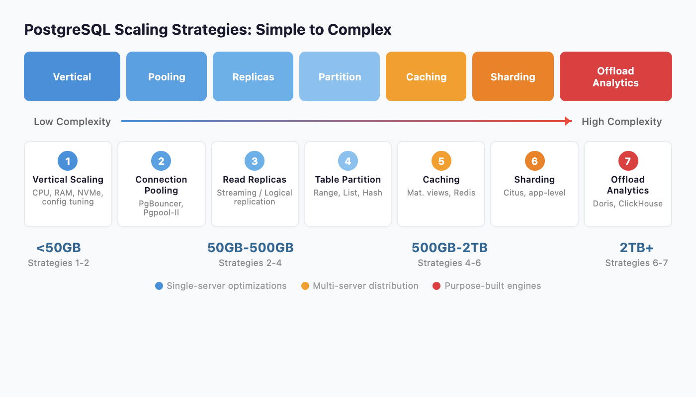
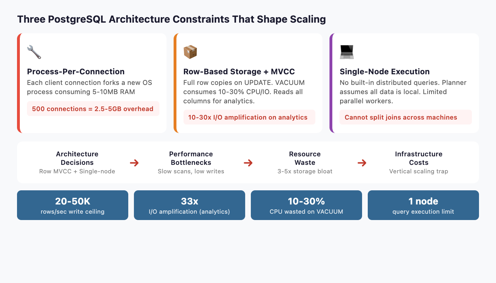
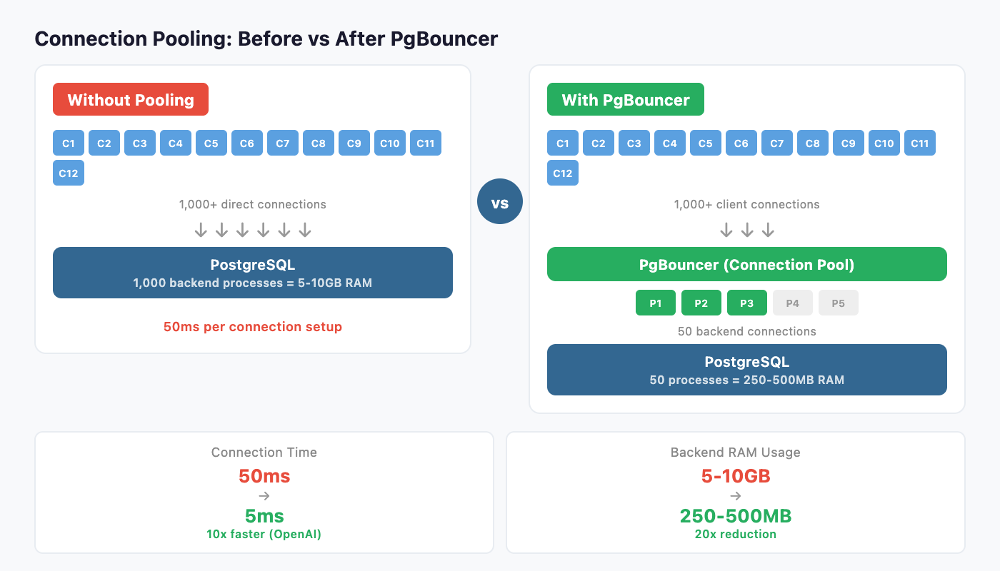
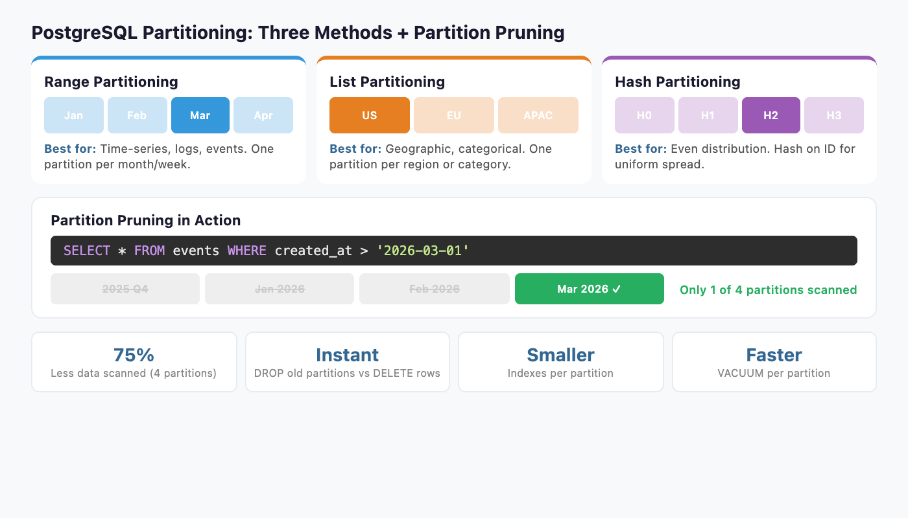
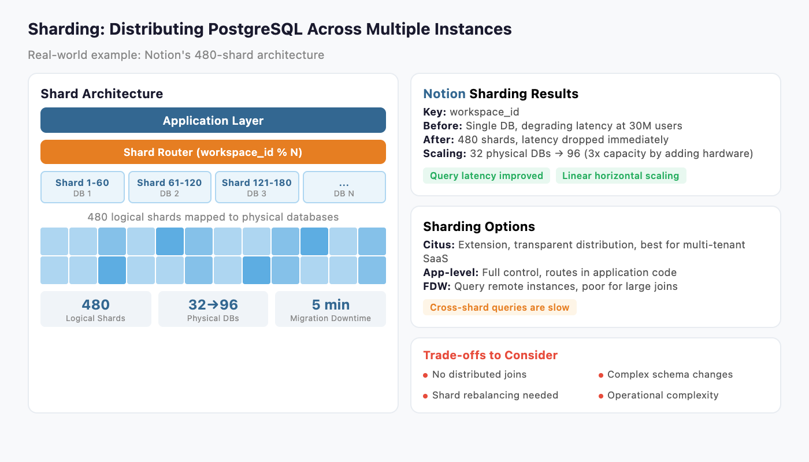
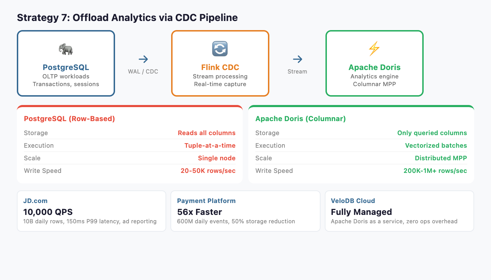
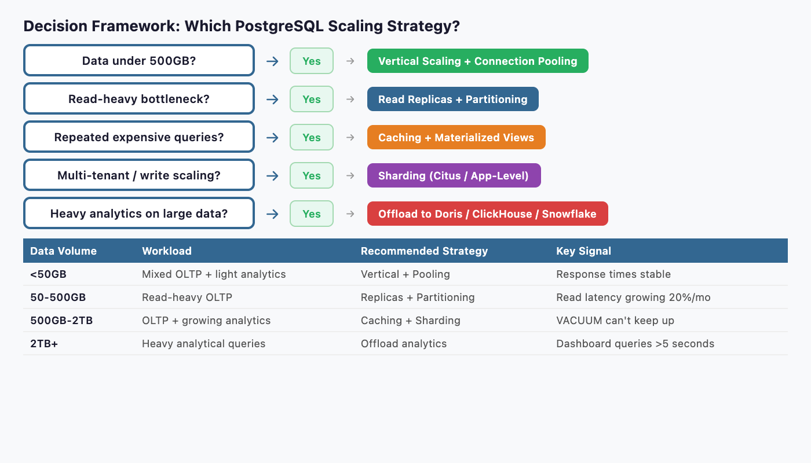

# 7 Ways to Scale PostgreSQL in 2026 (When Each One Breaks)



PostgreSQL is the [most admired and most desired database among professional developers](https://survey.stackoverflow.co/2025/technology/) for the third consecutive year, used by 55.6% of professionals in the [2025 Stack Overflow survey](https://survey.stackoverflow.co/2025/technology/). It has earned [DB-Engines DBMS of the Year](https://db-engines.com/en/blog_post/106) four times. OpenAI serves [800 million ChatGPT users on PostgreSQL](https://openai.com/index/scaling-postgresql/). Notion shards its entire backend across [480 PostgreSQL databases](https://www.notion.com/blog/sharding-postgres-at-notion).

PostgreSQL can scale. The question every growing team faces is not whether PostgreSQL can handle their workload, but which scaling strategy fits their specific bottleneck. The wrong choice wastes months of engineering effort. The right choice buys years of runway.

This guide covers seven strategies in order of complexity, from tuning a single server to offloading analytics entirely. Each section explains when the strategy works, when it stops working, and the specific thresholds that signal you need to move to the next one.

Most teams will combine two or three strategies. A typical production stack might use connection pooling, read replicas, and partitioning simultaneously. The key is knowing which strategy addresses your actual bottleneck rather than applying them randomly.

## Why PostgreSQL Hits Scaling Walls: The Architecture



Before choosing a strategy, you need to understand three architectural decisions that shape every scaling option.

**Process-per-connection model.** PostgreSQL forks a new backend process for every client connection. Each process consumes 5-10MB of RAM. At 500 connections, that is 2.5-5GB of memory before a single query runs. At 5,000 connections, the OS spends more time context-switching between processes than executing queries.

**Row-based storage with MVCC.** Every UPDATE creates a full copy of the row. Dead rows accumulate until VACUUM cleans them up, consuming 10-30% of CPU and I/O in write-heavy workloads. Analytical queries scanning wide tables read every column even when they only need three, amplifying I/O by 10-30x compared to columnar storage.

**Single-node query execution.** The query planner and executor assume all data lives on one machine. Parallel query uses multiple workers on a single server, but PostgreSQL has no built-in distributed query execution. You cannot split a join across ten machines the way a purpose-built MPP engine can.

These three constraints determine which scaling strategies help and which ones just delay the inevitable. Keep them in mind as you read each approach.

## Strategy 1: Vertical Scaling (Tune the Single Server)

The simplest approach. Add more hardware, tune PostgreSQL configuration, and optimize queries.

### What to Do

Upgrade CPU, RAM, and storage. Switch to NVMe SSDs if you have not already. Then tune the three most impactful settings:

- **`shared_buffers`**: Set to 25% of total RAM (e.g., 64GB on a 256GB machine). This is PostgreSQL's internal buffer cache.
- **`work_mem`**: Set to 256MB-1GB for analytical queries. Controls memory for sorts and hash joins before spilling to disk.
- **`effective_cache_size`**: Set to 75% of total RAM. Tells the planner how much data the OS page cache likely holds.

Add strategic indexes. Use `EXPLAIN (ANALYZE, BUFFERS)` to find sequential scans on large tables. Partial indexes on frequently filtered columns can cut query times by 90%.

Run regular maintenance. Schedule `ANALYZE` to keep statistics fresh so the planner chooses good execution plans. Enable `autovacuum` with aggressive settings for high-write tables: set `autovacuum_vacuum_scale_factor` to 0.01 (instead of the default 0.2) so VACUUM triggers after 1% of rows change instead of 20%.

### How to Measure the Impact

Before and after tuning, measure three metrics to confirm improvement:

- **Cache hit ratio**: Query `pg_stat_user_tables` for `heap_blks_hit / (heap_blks_hit + heap_blks_read)`. Target 99%+ for OLTP workloads. If below 95%, increase `shared_buffers`.
- **Disk I/O wait**: Check `pg_stat_io` or OS-level `iostat`. If I/O wait exceeds 20% during peak, storage is the bottleneck. Move to NVMe or add RAM for caching.
- **Query latency percentiles**: Track p50, p95, and p99 using `pg_stat_statements`. A healthy system has p99 under 5x the p50.

### When It Works

Vertical scaling handles most workloads under 500GB with moderate concurrency (under 200 simultaneous connections). A well-tuned PostgreSQL instance on modern hardware can process millions of OLTP transactions per day.

### When It Breaks

Diminishing returns hit hard. Doubling RAM from 256GB to 512GB rarely doubles throughput. CPU clock speeds plateau. You also create a single point of failure: one server failure takes down everything. And vertical scaling does nothing for the connection model or write throughput. At a certain point, you are paying exponentially more for linearly better performance.

**Move to the next strategy when:** You have tuned configuration, optimized queries, and still see response times degrading month over month. Or when your single largest table exceeds 200 million rows.

## Strategy 2: Connection Pooling



Connection pooling is the highest-ROI change most teams can make. It directly addresses PostgreSQL's process-per-connection bottleneck.

### What to Do

Deploy [PgBouncer](https://www.pgbouncer.org/) between your application and PostgreSQL. PgBouncer maintains a small pool of persistent backend connections and multiplexes thousands of client connections across them.

Other options include [Pgpool-II](https://www.pgpool.net/) (adds load balancing and replication management) and [pgCat](https://github.com/postgresml/pgcat) (Rust-based, supports sharding). PgBouncer is the industry default for pure connection pooling.

### Real-World Impact

OpenAI's PostgreSQL infrastructure serves millions of queries per second. Their [engineering team reported](https://openai.com/index/scaling-postgresql/) that PgBouncer reduced connection establishment time from 50ms to 5ms, a 10x improvement. Before pooling, connection overhead was a significant fraction of total query latency.

### When It Works

Connection pooling helps immediately if your application opens and closes connections frequently, or if you see high connection counts in `pg_stat_activity`. Most web applications with connection-per-request patterns benefit.

### Configuration Tips

PgBouncer supports three pooling modes:

- **Transaction mode** (recommended for most apps): Connections return to the pool after each transaction. Supports the highest multiplexing ratio but breaks session-level features like prepared statements and `SET` commands.
- **Session mode**: Connections stay assigned for the entire client session. Safer compatibility but lower multiplexing.
- **Statement mode**: Connections return after each statement. Highest throughput but does not support multi-statement transactions.

Set `default_pool_size` to match your PostgreSQL `max_connections` divided by the number of databases. For most applications, 20-50 backend connections per database handle thousands of concurrent clients.

### When It Breaks

Pooling reduces connection overhead. It does not reduce query execution time. If your queries are slow because tables are large or joins are complex, pooling will not help. It also introduces complexity around prepared statements and session-level state, since connections are shared in transaction mode.

**Move to the next strategy when:** Connection pooling is deployed and connection overhead is no longer the bottleneck, but read query latency is still too high.

## Strategy 3: Read Replicas

Streaming replication is PostgreSQL's native answer to read scaling. Create copies of the primary database and route read queries to them.

### What to Do

Set up streaming replication with one or more standby servers. Use a load balancer (HAProxy) or middleware (Pgpool-II) to route read queries to replicas and writes to the primary.

For more flexibility, logical replication lets you replicate specific tables to subscriber databases. This is useful when different services need different subsets of data.

For automated failover, add [Patroni](https://github.com/patroni/patroni) to manage your replica cluster. Patroni uses a distributed consensus store (etcd or ZooKeeper) to elect a new primary automatically when the current one fails. Combined with HAProxy, you get a self-healing read replica cluster that handles both load distribution and high availability.

### Real-World Impact

OpenAI runs a [single primary instance with nearly 50 read replicas](https://openai.com/index/scaling-postgresql/) spread across multiple regions. This architecture handles the read-heavy workload of 800 million ChatGPT users. Their p99 latency stays in the low double-digit milliseconds.

### Scaling Reads Linearly

Each replica can handle roughly the same read throughput as the primary. Five replicas give you approximately 5x read capacity. This scales nearly linearly for read-heavy workloads, which describes most web applications (90%+ reads).

### When It Breaks

Replicas do not help with write throughput. All writes still go to a single primary. At high write volumes, the primary becomes the bottleneck regardless of how many replicas you add.

Replication lag is the other problem. Streaming replication is asynchronous by default, meaning replicas can lag seconds behind the primary during write spikes. Synchronous replication eliminates lag but reduces write throughput because the primary waits for replicas to confirm.

For analytical queries that scan large tables, replicas help distribute load but each replica still performs the same expensive full-table scan. The query itself is not faster, you just run more of them in parallel.

There is also a subtler problem: replicas consume the same resources as the primary for every query. A 30-second analytical scan on a replica uses the same CPU and I/O as it would on the primary. With five replicas running the same analytical workload, you pay for five times the compute without improving individual query speed.

**Move to the next strategy when:** Write throughput is the bottleneck, or individual query performance on large tables is unacceptable regardless of available replicas.

## Strategy 4: Table Partitioning



Partitioning breaks large tables into smaller physical pieces. The query planner automatically skips partitions that do not match the query filter, a technique called partition pruning.

### What to Do

PostgreSQL supports three partitioning methods:

| Method | Best For | Example |
|--------|----------|---------|
| **Range** | Time-series, logs, events | One partition per month |
| **List** | Geographic, categorical | One partition per region |
| **Hash** | Even distribution | 16 hash partitions for uniform spread |

Declare partitioning on your largest tables. For a 2TB events table partitioned by month, a query filtering on `created_at > '2026-01-01'` only scans the relevant monthly partitions instead of the entire table.

### Benefits Beyond Performance

Partitioning makes maintenance faster. `VACUUM` operates on individual partitions rather than the full table. Dropping old data becomes instant: `DROP TABLE events_2024_01` removes an entire partition without row-by-row deletion.

Index size decreases per-partition, improving cache hit rates. Backup and restore can target specific partitions.

### When It Works

Partitioning shines when queries filter on the partition key. Time-range queries on time-partitioned tables see dramatic improvements. Start partitioning when any single table exceeds 100 million rows or 50GB.

### When It Breaks

Cross-partition queries that scan all partitions (e.g., `SELECT * FROM events WHERE user_id = 123` on a time-partitioned table) get no benefit. They may even slow down due to the overhead of querying multiple child tables.

Partition management adds operational complexity. You need to create new partitions ahead of time (or use automation like `pg_partman`). Too many partitions (thousands) can slow down planning.

**Move to the next strategy when:** Tables are partitioned but analytical queries still scan too many partitions, or write throughput on the primary is the bottleneck.

## Strategy 5: Caching and Materialized Views

Not every query needs to hit PostgreSQL. Caching precomputed results eliminates repeat work for expensive queries.

### What to Do

**Materialized views** store the result of a complex query as a physical table. Refresh them on a schedule:

```sql
CREATE MATERIALIZED VIEW daily_revenue AS
SELECT date_trunc('day', created_at) AS day,
       product_id,
       SUM(amount) AS total_revenue,
       COUNT(*) AS order_count
FROM orders
GROUP BY 1, 2;

-- Refresh every hour
REFRESH MATERIALIZED VIEW CONCURRENTLY daily_revenue;
```

**Application-level caching** with Redis or Memcached stores frequently accessed results closer to the application. Cache dashboard queries, leaderboard computations, and session data.

**TimescaleDB continuous aggregates** automatically maintain materialized rollups for time-series data. When new data arrives, only the affected time buckets are recomputed, not the entire view.

### When It Works

Caching works when the same expensive queries run repeatedly with tolerance for slightly stale data. Dashboards, reports, and leaderboards are ideal candidates. A materialized view that takes 30 seconds to compute can serve thousands of reads per second once refreshed.

### When It Breaks

Real-time requirements defeat caching. If users need to see data from the last 5 seconds, a materialized view refreshed every hour is useless. High-cardinality queries (millions of unique filter combinations) cannot be precomputed.

Cache invalidation is the other classic problem. Stale data in Redis can serve wrong results. `REFRESH MATERIALIZED VIEW CONCURRENTLY` takes a lock and consumes resources proportional to the view's size.

**Move to the next strategy when:** Your workload requires real-time analytics over large datasets, or the number of unique query patterns exceeds what caching can handle.

## Strategy 6: Sharding



Sharding distributes data across multiple independent PostgreSQL instances. Each instance (shard) holds a subset of the data, determined by a sharding key.

### What to Do

**Citus** (PostgreSQL extension, now part of Microsoft Azure) transparently distributes tables and queries across worker nodes. You add `SELECT create_distributed_table('orders', 'tenant_id')` and Citus handles routing. This is the lowest-friction option for multi-tenant SaaS.

**Application-level sharding** routes queries in your application code based on the sharding key. This gives full control but requires engineering each query to target the correct shard.

**Postgres-XL** and **Spock** (from pgEdge) offer alternative approaches. Postgres-XL is a full fork with a coordinator node, while Spock provides multi-master logical replication where each node can accept writes. Spock is particularly useful for geographically distributed deployments where users write to the nearest node.

### Real-World Impact: Notion

Notion ran on a single PostgreSQL database until 2021. As they approached 30 million users, query latency degraded and table sizes reached multiple terabytes. Their engineering team [built a sharding system](https://www.notion.com/blog/sharding-postgres-at-notion) that:

- Split data across **480 logical shards** mapped to **32 physical databases** (later scaled to 96)
- Used `workspace_id` as the sharding key
- Completed the migration with only **5 minutes of scheduled downtime**
- Immediately saw query latency drop and throughput increase

### The Honest Trade-Off

Sharding PostgreSQL means retrofitting distribution onto a system designed for a single node. The query planner has no concept of distributed joins. Cross-shard queries require your application (or Citus) to query multiple shards and merge results. This works for tenant-isolated queries. It struggles with global aggregations like "total revenue across all tenants."

Foreign data wrappers (FDW) let you query remote PostgreSQL instances, but performance is poor for large joins because data must be pulled across the network.

Schema changes become complex. Rolling out an `ALTER TABLE` across 96 physical databases requires orchestration and careful rollback planning.

### When It Works

Sharding works when data naturally partitions by a key (tenant, user, workspace) and most queries are scoped to a single shard. Multi-tenant SaaS applications are the ideal case.

### When It Breaks

Global analytical queries spanning all shards are slow. Operational complexity multiplies: you manage dozens or hundreds of PostgreSQL instances instead of one. Rebalancing shards when data grows unevenly requires data migration.

**Move to the next strategy when:** You need fast analytical queries across the full dataset, not just within individual shards. Or when the operational burden of managing hundreds of PostgreSQL instances outweighs the benefits.

## Strategy 7: Offload Analytics to a Purpose-Built Engine



Every strategy above optimizes PostgreSQL for workloads it was not architected for. At some point, the pragmatic choice is to keep PostgreSQL for what it does best (OLTP: transactions, user sessions, order processing) and route analytical workloads to an engine built for them.

### Why OLTP Engines Struggle with Analytics

The architectural constraints from earlier in this article compound:

| PostgreSQL (Row-Based OLTP) | Columnar Analytical Engine |
|---------------------------|---------------------------|
| Reads entire rows (all columns) | Reads only queried columns |
| Tuple-at-a-time processing | Vectorized batch processing |
| Single-node execution | Distributed MPP execution |
| 20-50K analytical rows/sec write | 200K-1M+ rows/sec write |
| VACUUM overhead on updates | Efficient bulk update support |

A query scanning 10 columns from a 200-column table reads **20x more data** in PostgreSQL than in a columnar engine. Vectorized execution processes 4,096 rows per batch instead of one at a time. MPP splits work across a cluster instead of relying on a single server.

### The Analytical Database Landscape

Several engines solve this problem. Choose based on your specific requirements:

| Engine | Strengths | Trade-offs |
|--------|-----------|------------|
| **[Apache Doris](https://doris.apache.org/)** | MySQL-compatible SQL, real-time UPDATE/DELETE, strong concurrent query support | Younger ecosystem than ClickHouse |
| **[ClickHouse](https://clickhouse.com/)** | Fastest single-table scans, mature append-optimized engine | Limited UPDATE/DELETE, weaker at high-concurrency user-facing queries |
| **[Snowflake](https://www.snowflake.com/)** | Managed service, separation of storage and compute | Consumption pricing can spike, cold start latency |
| **[BigQuery](https://cloud.google.com/bigquery)** | Serverless, handles petabytes | Vendor lock-in to GCP, cold start latency for user-facing apps |
| **[Redshift](https://aws.amazon.com/redshift/)** | Deep AWS integration, Redshift Serverless option | Complex tuning (sort keys, dist keys), slower on concurrent queries |

### Apache Doris in Practice

For teams that need real-time analytics with UPDATE/DELETE support (not just append-only), Apache Doris is purpose-built for this gap. It combines columnar storage, vectorized execution, and MPP architecture with MySQL-protocol compatibility, meaning existing SQL tools and BI platforms connect without code changes.

Real-world results from companies that migrated analytical workloads from PostgreSQL-like systems:

- **JD.com** (ad reporting analytics): 10 billion rows ingested daily, serving [over 10,000 QPS with P99 latency of 150ms](https://doris.apache.org/docs/2.0/gettingStarted/what-is-apache-doris/)
- **Payment platform** (financial analytics): Moved from Elasticsearch to Doris, achieving [56x faster queries with 50% storage reduction](https://doris.apache.org/blog/from-elasticsearch-to-doris-boosting-queries-by-56x/)
- **Observability platform**: Processing 600 million daily events, replacing a complex multi-engine pipeline with a single Doris cluster

[VeloDB](https://www.velodb.io/) provides a fully managed cloud service built on Apache Doris, removing the operational overhead of running your own cluster. This is relevant for teams that want the analytical performance without adding infrastructure management work.

### How to Set It Up

The standard pattern uses Change Data Capture (CDC) to stream changes from PostgreSQL to the analytical engine:

1. **PostgreSQL** handles OLTP (transactions, user sessions, writes)
2. **Debezium or Flink CDC** captures row changes from PostgreSQL's WAL
3. **Apache Doris** (or your chosen engine) ingests the stream for analytical queries
4. **Dashboards and BI tools** query the analytical engine directly

This architecture lets each database do what it was designed for. PostgreSQL stays lean for OLTP. The analytical engine handles the scan-heavy, aggregation-heavy queries that bog PostgreSQL down.

The latency for data propagation depends on your CDC tool. Debezium with Kafka typically delivers changes within seconds. Flink CDC can achieve sub-second latency with direct streaming. For most analytical dashboards, a 5-10 second delay between a PostgreSQL write and its availability in the analytical engine is acceptable. For real-time dashboards tracking live transactions, Flink CDC's direct streaming mode minimizes the gap.

### What About PostgreSQL-Native Analytical Extensions?

Before committing to a separate engine, consider PostgreSQL extensions that add analytical capabilities:

- **TimescaleDB** adds columnar compression and continuous aggregates for time-series workloads. It runs inside PostgreSQL, avoiding the complexity of a separate system. The trade-off: it still uses PostgreSQL's single-node execution model, so it helps with storage efficiency but not with distributed query processing.
- **Citus** (as mentioned in sharding) can distribute analytical queries across worker nodes. For multi-tenant analytics where queries are scoped to a tenant, Citus performs well. For global aggregations across all data, a purpose-built MPP engine still wins.
- **pg_analytics** (from ParadeDB) is an emerging extension that adds DuckDB-powered analytical query processing inside PostgreSQL. It is worth watching but still maturing.

These extensions work when analytical workloads are moderate. When you reach terabyte-scale scans, high-concurrency user-facing dashboards, or sub-second latency requirements across billions of rows, a dedicated engine outperforms extensions running on PostgreSQL's row-based foundation.

### When This Strategy Fits

Offload analytics when any of these conditions apply:

- Dashboard queries regularly exceed 5-second response times despite tuning
- Analytical tables exceed 1TB and queries scan wide columns
- You need sub-second query latency for user-facing analytics (multi-tenant dashboards, embedded analytics)
- ETL jobs consume significant resources on the primary and compete with OLTP traffic
- Your team spends more time tuning PostgreSQL for analytics than building product features

## Decision Framework: Which Strategy When?



Most production systems combine multiple strategies. Here is a progression based on data volume and workload characteristics:

| Data Volume | Concurrency | Workload | Recommended Strategies |
|-------------|-------------|----------|----------------------|
| Under 50GB | Low-Medium | Mixed OLTP + light analytics | **Vertical scaling** + **connection pooling** |
| 50-500GB | Medium | Read-heavy OLTP | Add **read replicas** + **partitioning** |
| 500GB-2TB | High | OLTP + growing analytics | Add **caching** + consider **sharding** for writes |
| 2TB+ | High | Heavy analytics alongside OLTP | **Offload analytics** to a purpose-built engine |
| Multi-tenant SaaS | Variable per tenant | Tenant-isolated queries | **Sharding** (Citus) + **connection pooling** |

### Signals That You Need the Next Level

Watch for these specific degradation patterns:

1. **Query response times increasing 20%+ month over month** despite tuning: you have outgrown vertical scaling
2. **Connection count regularly exceeding 200** with growing tail latency: deploy connection pooling
3. **Read replicas at 80%+ CPU** during peak hours: add more replicas or consider caching
4. **VACUUM cannot keep up** (dead tuple ratio exceeding 5% week over week): partitioning or architectural change needed
5. **Analytical queries competing with OLTP** for resources, causing user-facing latency spikes: time to offload analytics

The most common mistake is not scaling too early. It is scaling the wrong dimension. Throwing read replicas at a write-throughput problem wastes time. Sharding when connection pooling would suffice adds unnecessary complexity. Match the strategy to the actual bottleneck.

### How Companies Actually Combine These Strategies

In practice, companies stack strategies as they grow. Here is a typical progression:

**Seed to Series A (under 100GB):** A single well-tuned PostgreSQL instance with PgBouncer handles everything. This is where most startups live for years. Do not over-engineer at this stage.

**Series B to Growth (100GB-1TB):** Add 2-5 read replicas for read-heavy traffic. Partition the largest tables by time range. Use materialized views for dashboard queries. This stack carries most companies through rapid growth without architectural changes.

**Scale (1TB+, multi-tenant, heavy analytics):** At this point, the path diverges. Multi-tenant SaaS companies typically adopt Citus for sharding. Companies with heavy analytical workloads deploy a dedicated engine like Apache Doris or ClickHouse alongside PostgreSQL. Some do both.

OpenAI reached 800 million users by pushing strategies 1-3 to their limits: aggressive tuning, PgBouncer, and nearly 50 read replicas. Notion chose strategy 6 (sharding) when their single database could no longer handle 30 million users. Neither company made the wrong choice. Each matched the strategy to their specific workload pattern.

### A Note on Monitoring

Whichever strategies you adopt, monitoring is non-negotiable. Set up [pg_stat_statements](https://www.postgresql.org/docs/current/pgstatstatements.html) to track query performance over time. Use Prometheus with the [postgres_exporter](https://github.com/prometheus-community/postgres_exporter) and Grafana for dashboards. Track these five metrics weekly: p95 query latency, connection count, cache hit ratio, dead tuple ratio, and replication lag (if using replicas). Trend lines matter more than absolute values. A p95 latency growing from 50ms to 80ms over three months signals trouble before users notice.

## Conclusion

PostgreSQL scales further than most teams expect. OpenAI serves 800 million users on it. Notion shards it across 480 databases. The seven strategies in this guide cover the full spectrum from single-server tuning to distributed analytical offloading.

Start with the simplest approach that addresses your actual bottleneck. Vertical scaling and connection pooling handle most workloads under 500GB. Read replicas and partitioning extend the runway into the terabyte range. Sharding works when data naturally segments by tenant or key.

When analytical workloads outgrow what a row-based, single-node system can deliver, offloading to a purpose-built columnar engine like Apache Doris, ClickHouse, or Snowflake is not a failure of PostgreSQL. It is using the right tool for each job. PostgreSQL excels at OLTP. Let it do that, and let an analytical engine handle the rest.

The one strategy to avoid: doing nothing and hoping the problem resolves itself. Data volumes only grow. Query complexity only increases. Every month of delay narrows your options and increases the eventual migration effort. Measure your bottleneck today, match it to the right strategy, and buy your team the runway to build what matters.
